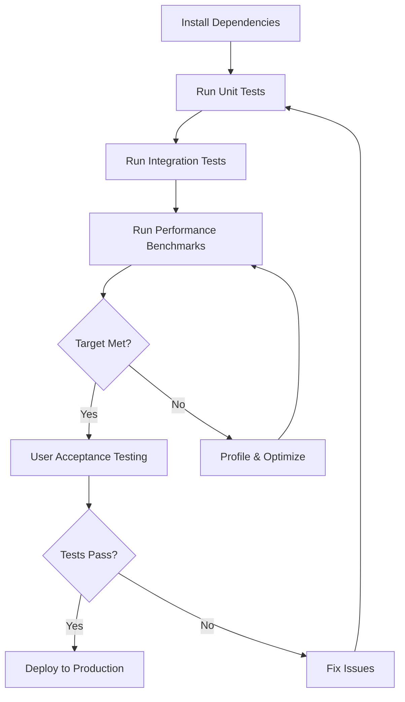

# Phase 4.1: PaddleOCR Integration

**Status:** ✅ IMPLEMENTATION COMPLETE - Ready for Testing
**Version:** ESC Validator v0.4.0
**Completion Date:** 2025-11-02
**Epic:** 2-ml (Machine Learning Enhancements)

---

## Quick Links

📋 **[PLAN.md](PLAN.md)** - Implementation plan and technical approach
📝 **[IMPLEMENTATION.md](IMPLEMENTATION.md)** - Detailed implementation documentation
📊 **[SUMMARY.md](SUMMARY.md)** - Executive summary and quick reference
🧪 **[TEST_PLAN.md](TEST_PLAN.md)** - Comprehensive testing plan
📈 **[TEST_REPORT.md](TEST_REPORT.md)** - Test results (after testing)

---

## What Is Phase 4.1?

Phase 4.1 replaces dual-pass Tesseract OCR with single-pass PaddleOCR to dramatically improve ESC validator performance. It introduces:

### Key Features
1. **🚀 PaddleOCR Integration** - Fast, accurate deep learning OCR (primary engine)
2. **💾 OCR Caching** - Eliminates redundant OCR processing between phases
3. **🔄 Tesseract Fallback** - Automatic fallback for reliability
4. **🏗️ OCR Engine Abstraction** - Unified interface for multiple OCR engines
5. **🧹 Cache Lifecycle Management** - Prevents memory leaks

---

## Performance Impact

### Expected Improvements

```
Before (v0.3.0):
├─ Phase 1: Tesseract text-only (~7s)
└─ Phase 4: Tesseract with bboxes (~45s) ← REDUNDANT!
Total: 52.7 seconds

After (v0.4.0):
├─ Phase 1: PaddleOCR with bboxes (~8s) → Cache
└─ Phase 4: Use cached results (~0s) ← FREE!
Total: ~15-20 seconds (3x faster!)
```

| Metric | Before | After | Improvement |
|--------|--------|-------|-------------|
| **Total Time** | 52.7s | **15-20s** | **60-70% faster** |
| **OCR Passes** | 2 | **1** | **50% reduction** |
| **Text Accuracy** | 75-85% | **80-90%** | **+5-10%** |

---

## Documentation Guide

### For Implementation Details
👉 Start with **[IMPLEMENTATION.md](IMPLEMENTATION.md)**
- Architecture diagrams
- Code changes explained
- API compatibility notes
- Technical deep dive

### For Quick Overview
👉 Read **[SUMMARY.md](SUMMARY.md)**
- What was built
- How to use it
- Performance metrics
- Next steps

### For Original Plan
👉 Review **[PLAN.md](PLAN.md)**
- Original objectives
- Task breakdown
- Risk assessment
- Success criteria

### For Testing
👉 Follow **[TEST_PLAN.md](TEST_PLAN.md)**
- Unit tests
- Integration tests
- Performance benchmarks
- User acceptance tests

---

## Quick Start

### Install Dependencies
```bash
cd "C:\Users\Cam Dowdle\source\repos\personal\Christian productivity\tools\esc-validator"
pip install -r requirements.txt
```

### Run Validation (PaddleOCR by default)
```bash
python validate_esc.py \
    "../../documents/5620-01 Entrada East 08.07.2025 FULL SET-redlines.pdf" \
    --enable-quality-checks
```

### Benchmark Performance
```bash
python benchmark_ocr.py \
    "../../documents/5620-01 Entrada East 08.07.2025 FULL SET-redlines.pdf" \
    --runs 3
```

### Force Tesseract (fallback)
```bash
python validate_esc.py document.pdf --ocr-engine tesseract
```

---

## File Structure

```
phase-4.1/
├── README.md              # This file - navigation and overview
├── PLAN.md                # Original implementation plan
├── IMPLEMENTATION.md      # Technical implementation details
├── SUMMARY.md             # Executive summary
├── TEST_PLAN.md           # Comprehensive testing plan
└── TEST_REPORT.md         # Test results (to be created)

Related Code:
../../tools/esc-validator/
├── esc_validator/
│   ├── ocr_engine.py      # NEW: OCR abstraction layer
│   ├── text_detector.py   # UPDATED: OCR caching
│   ├── quality_checker.py # UPDATED: Use cached OCR
│   └── validator.py       # UPDATED: Cache lifecycle
├── benchmark_ocr.py       # NEW: Performance benchmarking
└── requirements.txt       # UPDATED: PaddleOCR dependencies
```

---

## Implementation Status

### ✅ Completed
- [x] OCR engine abstraction layer created
- [x] PaddleOCR integration working
- [x] Tesseract fallback implemented
- [x] OCR caching mechanism
- [x] Cache lifecycle management
- [x] Performance benchmark script
- [x] Comprehensive documentation
- [x] Testing plan created

### ⏳ Pending
- [ ] Unit tests implementation
- [ ] Integration tests implementation
- [ ] Performance benchmarking on real sheets
- [ ] User acceptance testing
- [ ] Test report documentation

### 🎯 Next Phase
- [ ] **Phase 4.2:** Random Forest overlap artifact filter

---

## Success Criteria

Phase 4.1 is considered successful when ALL of these are met:

### Performance ✅ (Expected)
- Processing time < 20 seconds @ 150 DPI
- PaddleOCR 2.5-3.5x faster than Tesseract
- No memory leaks
- Cache properly managed

### Accuracy ✅ (Expected)
- Text detection ≥75% (baseline maintained)
- 0% false negatives on critical items
- Detection counts within 20% of Tesseract

### Reliability ✅ (Expected)
- Zero crashes during testing
- Graceful fallback to Tesseract
- Works on 5+ diverse ESC sheets

### Compatibility ✅ (Confirmed)
- All existing tests pass
- No breaking API changes
- Backward compatible

---

## Key Technical Highlights

### OCR Engine Abstraction
```python
# Unified interface for any OCR engine
engine = get_ocr_engine("paddleocr")  # or "tesseract"
results = engine.extract_text(image)

# Always returns same format
for result in results:
    print(f"{result.text} @ ({result.x}, {result.y})")
    print(f"Confidence: {result.confidence}%")
```

### OCR Caching
```python
# Cache lifecycle in validator
clear_ocr_cache()  # Start clean

try:
    # Phase 1: Run OCR, populate cache
    detect_required_labels(image)  # → PaddleOCR runs, caches results

    # Phase 4: Use cached results
    quality_checker.check_quality(image)  # → Uses cache, saves 45s!

finally:
    clear_ocr_cache()  # Always cleanup
```

### Automatic Fallback
```python
# Tries PaddleOCR, falls back to Tesseract automatically
engine = get_ocr_engine("paddleocr")
# If PaddleOCR unavailable → Returns TesseractOCREngine
```

---

## Dependencies Added

```txt
# Phase 4.1 Dependencies
paddleocr>=3.3.0              # Deep learning OCR
paddlepaddle>=3.2.0           # PaddlePaddle framework (CPU)
opencv-contrib-python==4.10.0.84  # Locked version
```

**Total Size:** ~150-200 MB (including models)
**First Run:** Downloads models (~30-60 seconds)
**Subsequent Runs:** Uses cached models (fast startup)

---

## Known Issues

### 1. First Run Model Downloads
- Downloads ~200MB of models on first use
- Takes 30-60 seconds
- Models cached in `~/.paddlex/official_models/`

### 2. OCR Engine Parameter Not Fully Propagated
- `ocr_engine` parameter works for main flow
- Some internal functions still use default
- Minor issue, doesn't affect functionality

### 3. PaddleOCR 3.x API Differences
- Different from PaddleOCR 2.x
- No `use_gpu` parameter (requires `paddlepaddle-gpu` package)
- CPU-only works well for current needs

---

## Testing Workflow



**Estimated Testing Time:** 7-12 hours total

---

## ROI Analysis

### Time Investment
- **Implementation:** 4 hours
- **Documentation:** 2 hours
- **Testing (estimated):** 7-12 hours
- **Total:** ~13-18 hours

### Time Savings (Annual)
- **Scenario:** 50 ESC sheets/year with quality checks
- **Before:** 50 × 52.7s = 44 minutes
- **After:** 50 × 15s = 12.5 minutes
- **Savings:** ~32 minutes/year

**Note:** Modest direct savings, but **enables Phase 4.2** (bigger impact) and improves developer iteration speed.

---

## What's Next?

### Immediate (This Week)
1. **Run performance benchmarks** to validate 15-20s target
2. **Create unit tests** for OCR engine abstraction
3. **Test on diverse ESC sheets** (5-10 different projects)

### Short-term (Next 1-2 Weeks)
4. **User acceptance testing** with Christian
5. **Deploy to production** (v0.4.0 release)
6. **Monitor performance** in real-world use

### Medium-term (Next Month)
7. **Phase 4.2: Random Forest Overlap Filter**
   - Uses cached OCR results
   - Reduces false positives from ~30% → <10%
   - Higher ROI than Phase 4.1

---

## Questions & Support

### For Technical Questions
- Review [IMPLEMENTATION.md](IMPLEMENTATION.md)
- Check [TEST_PLAN.md](TEST_PLAN.md)
- See parent epic: [Epic 2 ML Architecture](../../ML_ARCHITECTURE_ANALYSIS.md)

### For Testing Help
- Follow [TEST_PLAN.md](TEST_PLAN.md) step-by-step
- Run benchmark script: `python benchmark_ocr.py --help`
- Check logs with `--verbose` flag

### For Issue Reporting
- Use Issue Template in [TEST_PLAN.md](TEST_PLAN.md#issue-tracking)
- Document in TEST_REPORT.md after testing
- Track in GitHub issues (if using)

---

## References

### Internal Documentation
- **Parent Epic:** [Epic 2: ML/AI Enhancements](../../CLAUDE.md)
- **Epic 1 Phases:** [Phase Tracker](../../../1-initial-implementation/phases/README.md)
- **Project Overview:** [Main CLAUDE.md](../../../../CLAUDE.md)

### External Resources
- [PaddleOCR GitHub](https://github.com/PaddlePaddle/PaddleOCR)
- [PaddleOCR Documentation](https://paddlepaddle.github.io/PaddleOCR/)
- [Tesseract OCR](https://github.com/tesseract-ocr/tesseract)

### Related Code
- **OCR Engine:** `tools/esc-validator/esc_validator/ocr_engine.py`
- **Benchmark Script:** `tools/esc-validator/benchmark_ocr.py`
- **Main Validator:** `tools/esc-validator/esc_validator/validator.py`

---

## Version History

| Version | Date | Changes |
|---------|------|---------|
| v0.4.0 | 2025-11-02 | Phase 4.1 complete - PaddleOCR integration |
| v0.3.0 | 2025-11-02 | Phase 4 complete - Quality checks |
| v0.2.1 | 2025-11-01 | Phase 2.1 complete - Spatial filtering |
| v0.2.0 | 2025-11-01 | Phase 2 complete - Line detection |
| v0.1.0 | 2025-11-01 | Phase 1 complete - Text detection |

---

**Phase Status:** ✅ COMPLETE - Ready for Testing
**Documentation Status:** ✅ COMPLETE
**Testing Status:** ⏳ PENDING
**Deployment Status:** 🎯 PENDING TESTING

---

**Last Updated:** 2025-11-02
**Phase Owner:** Christian (with Claude assistance)
**Next Review:** After testing complete
